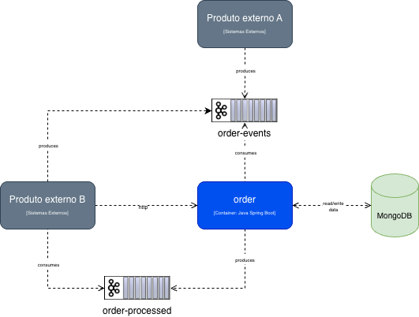
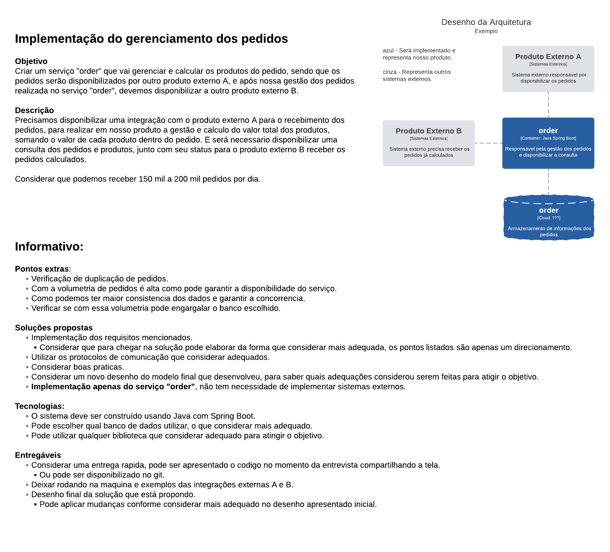

# Desafio Técnico AMCom - Order Processing Service

Aplicação desenvolvida como parte do processo seletivo para vaga Senior na AMCom. O objetivo é processar eventos de pedidos (criação, cancelamento e conclusão) assegurando alta capacidade diária (150k a 200k requisições) com arquitetura limpa, observabilidade e robustez.

## Sumário
1. Contexto do Desafio
2. Arquitetura (MVC + Event-Driven)
3. Tecnologias e Bibliotecas
4. Executando a Aplicação
5. Estrutura de Pastas
6. Fluxo de Processamento dos Pedidos
7. Desenho da solução - Diagrama de Componentes
8. Imagem da Problemática
9. Performance e Capacidade
10. Testes e Cobertura
11. Observabilidade e Resiliência
12. Próximos Passos
13. Integrações e Postman

## 1. Contexto do Desafio
O sistema deve receber eventos de pedidos e persistir seu estado. Deve ser capaz de escalar para suportar de 150.000 a 200.000 requisições/dia, processando alterações de estado em tempo quase real.

## 2. Arquitetura (MVC + Event-Driven)
- Camada Controller: expõe endpoints REST para criação e consulta de pedidos.
- Camada Service: regras de negócio (criar, cancelar, concluir, listar, buscar).
- Camada Repository: acesso a dados (MongoDB) orientado a documentos.
- Commands: encapsulam validação e execução de ações a partir de eventos (Create, Cancel, Complete).
- Event Producer/Consumer (Kafka): integra fluxo assíncrono garantindo desacoplamento e resiliência.
- Handler global de exceções para respostas consistentes.

O padrão MVC é complementado por uma arquitetura orientada a eventos para garantir escalabilidade horizontal (consumo concorrente, retry e DLQ).

## 3. Tecnologias e Bibliotecas
- Spring Boot 3.5.x
- Spring Web
- Spring Data MongoDB
- Spring Kafka
- Lombok (redução de boilerplate)
- Jackson (serialização JSON)
- Springdoc OpenAPI (documentação de endpoints)
- JaCoCo (cobertura de testes)
- JUnit 5 + Mockito (testes unitários)

## 4. Executando a Aplicação
### Requisitos
- Docker / Docker Compose
- Java 21 (para execução local sem containers)

### Via Docker Compose
```bash
docker compose up -d --build
```
Serviços levantados:
- app: aplicação Spring Boot
- kafka / zookeeper: broker de eventos
- kafka-ui: interface web para monitoramento de tópicos Kafka
- mongodb: banco NoSQL

Encerrar:
```bash
docker compose down -v
```

### Local (sem Docker)
1. Subir instâncias externas (MongoDB e Kafka) ou usar containers separados.
2. Ajustar `application.yaml` se necessário.
3. Executar:
```bash
./mvnw spring-boot:run
```

## 5. Estrutura de Pastas (Resumo)
```
src/main/java/com/amcom/desafio_tecnico_amcom/
  controller/        # REST endpoints
  service/           # Regras de negócio
  repository/        # Persistência (MongoDB)
  model/             # DTOs, Entities, Events, Enums
  exception/         # Tratamento de erros
  command/           # Commands (Create, Cancel, Complete)
  stream/            # Kafka (consumer/producer)
  config/            # Configurações (Kafka, Mongo, etc)
  support/           # Utilitários e helpers
```

## 6. Fluxo de Processamento dos Pedidos
1. Evento de criação recebido via Kafka no tópico order-events.
2. Validação (Command) -> Serviço -> Persistência.
3. Emissão de evento processado (Producer) para tópico order-processed.
5. Consultas dos pedidos via REST (Controller → Service → Repository).
6. Eventos de cancelamento e conclusão recebido via Kafka no tópico order-events.
7. Processamento similar ao de criação, atualizando o estado do pedido.

## 7. Desenho da solução - Diagrama de Componentes
Diagrama de componentes disponível na pasta `docs/architecture/`.
- Arquivo editável (Draw.io): `diagrama-componentes.drawio`
- Renderização atual: `diagrama-componentes.png`



## 8. Imagem da Problemática


## 9. Performance e Capacidade
- Requisito: 150k a 200k requisições/dia.
- Teste de carga (interno): ~1169 eventos de criação de pedidos por segundo.
- Projeção diária teórica: 1169 * 86400 ≈ 100.8 milhões eventos/dia (capacidade excede requisito, margem para variação).

## 10. Testes e Cobertura
Executar testes e relatório de cobertura:
```bash
./mvnw clean test jacoco:report
```
Relatório: `target/site/jacoco/index.html`.
Meta configurada: ≥ 90% de cobertura por classe (plugin JaCoCo no `pom.xml`).

## 11. Observabilidade e Resiliência
- Logs estruturados (SLF4J) para tracing básico.
- DLQ para mensagens que excedem tentativas de processamento.
- BackOff configurado (FixedBackOff) em listeners Kafka.
- Estratégia de idempotência pelo uso de `externalId` na criação de pedidos.

## 12. Próximos Passos
- Adicionar métricas (Micrometer + Prometheus).
- Implementar testes de carga automatizados (Gatling ou k6).

## 13. Integrações e Postman
Foram adicionados exemplos de integração nos arquivos:
- `docs/integrations/servico-a.md` (evento CREATE do Serviço A)
- `docs/integrations/servico-b.md` (processamento e emissão de COMPLETE/CANCEL)

A collection Postman para facilitar testes dos endpoints REST está disponível em:
- `docs/postman/amcom.postman_collection.json`

Importe a collection no Postman (File > Import) e ajuste variáveis de ambiente (URL base, portas) conforme seu ambiente local ou Docker.
